```
#Question 1
import pandas as pd
import numpy as np
import matplotlib.pyplot as plt
import seaborn

df1 = pd.read_csv("Lab2_Data/DF1")

#column 0 and 1
#using matplotlib
plt.scatter(x = df1["0"], y = df1["1"])
plt.title("Col 0 vs Col 1")
plt.xlabel("Column 0")
plt.ylabel("Column 1")
plt.show()

#seaborn
axs = seaborn.regplot(x = df1["0"], y = df1["1"], color = 'g')
axs.set_title("Col 0 vs Col 1 (using seaborn)")
axs.set_xlabel("Column 0")
axs.set_ylabel("Column 1")
plt.show()

#column 0 and 2
#using matplotlib
plt.scatter(x = df1["0"], y = df1["2"])
plt.title("Col 0 vs Col 2")
plt.xlabel("Column 0")
plt.ylabel("Column 2")
plt.show()

axs1 = seaborn.regplot(x = df1["0"], y = df1["2"], color = 'g')
axs1.set_title("Col 0 vs Col 2 (using seaborn)")
axs1.set_xlabel("Column 0")
axs1.set_ylabel("Column 2")
plt.show()

#column 0 and 3
#using matplotlib
plt.scatter(x = df1["0"], y = df1["3"])
plt.title("Col 0 vs Col 3")
plt.xlabel("Column 0")
plt.ylabel("Column 3")
plt.show()

#using seaborn
ax2 = seaborn.regplot(x = df1["0"], y = df1["3"], color = 'g')
ax2.set_title("Col 0 vs Col 3 (using seaborn)")
ax2.set_xlabel("Column 0")
ax2.set_ylabel("Column 3")
plt.show()

#column 1 and 2
#using matplotlib
plt.scatter(x = df1["1"], y = df1["2"])
plt.title("Col 1 vs Col 2")
plt.xlabel("Column 1")
plt.ylabel("Column 2")
plt.show()

#using seaborn
ax3 = seaborn.regplot(x = df1["1"], y = df1["2"], color = 'g')
ax3.set_title("Col 1 vs Col 2 (using seaborn)")
ax3.set_xlabel("Col 1")
ax3.set_ylabel("Col 2")
plt.show()

#column 1 and 3
#using matplotlib
plt.scatter(x = df1["1"], y = df1["3"])
plt.title("Col 1 vs Col 3")
plt.xlabel("Column 1")
plt.ylabel("Column 3")
plt.show()

#using seaborn
ax4 = seaborn.regplot(x = df1["1"], y = df1["3"], color = 'g')
ax4.set_title("Col 1 vs Col 3 (using seaborn)")
ax4.set_xlabel("Column 1")
ax4.set_ylabel("Column 3")
plt.show()

#column 2 and 3
#using matplotlib
plt.scatter(x = df1["2"], y = df1["3"])
plt.title("Col 2 vs Col 3")
plt.xlabel("Column 2")
plt.ylabel("Column 3")
plt.show()

#seaborn
ax5 = seaborn.regplot(x = df1["2"], y = df1["3"], color= 'g')
ax5.set_title("Col 2 vs Col 3 (using seaborn)")
ax5.set_xlabel("Column 2")
ax5.set_ylabel("Column 3")
plt.show()


```


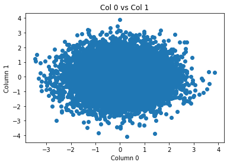


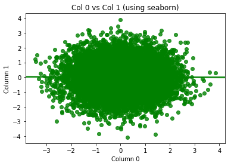


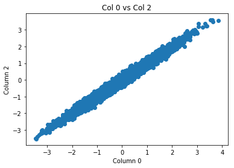


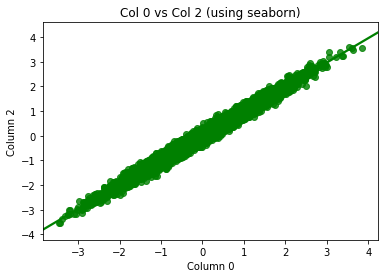


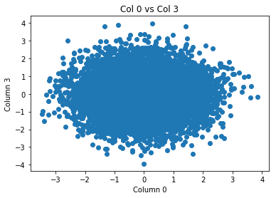


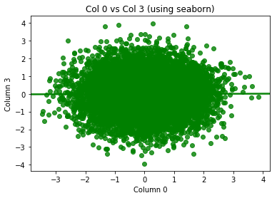


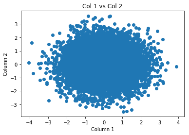


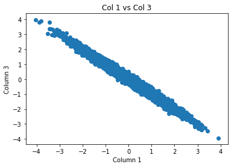


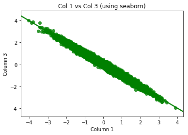


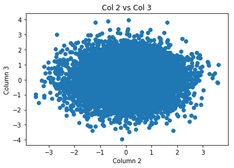


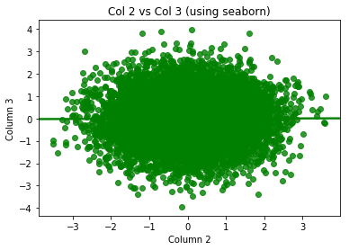


```
#Question 1 continued ...

#calculating the covariance
X = np.stack((df1["0"], df1["1"], df1["2"], df1["3"]), axis = 0)
covMatrix = np.cov(X)
print(covMatrix)


```

    [[ 1.00155793 -0.00401176  0.99162409  0.00412485]
     [-0.00401176  1.00537841 -0.00409877 -0.99545662]
     [ 0.99162409 -0.00409877  1.00158867  0.00408108]
     [ 0.00412485 -0.99545662  0.00408108  1.00516828]]


```
#Question 2

cov = [[1, 0, 0],[0, 1, 1],[0, 1, 1]]
mean = [0, 0, 0]

estimated_covariances = []
y1 = []
for i in range(50, 10000):
    X1, X2, X3 = np.random.multivariate_normal(mean, cov, i).T
    temp = np.cov(X2, X3)
    estimated_covariances.append(temp[0][1])
    y1.append(1)

plt.plot(estimated_covariances)
plt.xlabel("Samples")
plt.ylabel("Covariance")
plt.plot(y1)
plt.show()


path = "/Users/pratyushsingh/Downloads/Lab2_Data/DF2"
df2 = pd.read_csv(path)
axs1 = seaborn.regplot(x = df2["0"], y = df2["1"], color = 'r')
axs1.set_title("DF2 data")
axs1.set_xlabel("Column 0")
axs1.set_ylabel("Column 1")
plt.show()


```


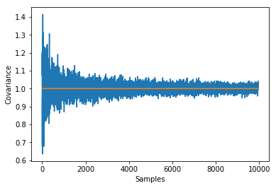


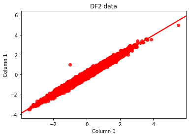


```
#2b
df2_new = df2.iloc[:,1:3] #remove the column that has the indexes
Q = np.linalg.cholesky(np.cov(df2_new["0"], df2_new["1"])) #compute cholesky to get Q
Q_inverse = np.linalg.inv(Q) #take inverse
df2_new = np.matmul(Q_inverse, np.transpose(df2_new)) #transpose df2_new so the dimensions match

data = {"0": df2_new[0], "1": df2_new[1]} #turn df2_new into a panda data frame
df2_new = pd.DataFrame(data=data)
axis = seaborn.regplot(x = df2_new["0"], y = df2_new["1"], color = 'purple')
axis.set_title("DF2 new data")
axis.set_xlabel("Column 0")
axis.set_ylabel("Column 1")
plt.show()

```


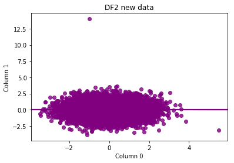


```
#Question 3
#yi = -3 + ei ~ N(0, 1)

mean = 0
std = 1
n = 150
b0 = -3
beta = 0
error = []
for i in range(1, 1000):
    xi = np.random.normal(mean, std, n)
    ei = np.random.normal(mean, std, n)
    yi = b0 + beta * xi + ei
    
    b_carrot = np.dot(yi, xi)/np.dot(xi, xi)
    stdev = b_carrot #you would subtract beta, but beta is 0
    error.append(stdev)

print(np.std(error))


```

    0.261913365866


```
#Question 3b
n = np.arange(1, 300)
samples = np.arange(1, 1000)

deviation = []
true_deviation = []
b0 = -3
beta = 0
mean = 0
std = 1
for i in n:
    error = []
    for j in samples:
        xi = np.random.normal(mean, std, i)
        ei = np.random.normal(mean, std, i)
        yi = b0 + beta * xi + ei
        
        b_carrot = np.dot(yi, xi)/np.dot(xi, xi)
        stdev = b_carrot
        error.append(stdev)
    
    deviation.append(np.std(error))
    true_deviation.append((1/(i ** 1/2)))

dev_line, = plt.plot(deviation)
trueDev_line, = plt.plot(true_deviation)
plt.legend((dev_line, trueDev_line), ("Error after many samples", "The formula: 1/sqrt(n)"))
plt.xlabel("n")
plt.ylabel("Error")
plt.show()
```


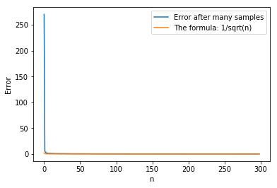


```
#Question 4
import pandas as pd
import numpy as np

#### part A #####
numOfNames = int(raw_input("How many names do you want?"))
year = raw_input("Enter a year from 1880-2015")
filePath = "C:\Users\gydoy\Documents\EE379K\lab2\Names" + "\yob" + year + ".txt"
print filePath

df = pd.read_csv(filePath, names = ["Name","Gender","Frequency"])
# names = pd.DataFrame.from_csv(filePath)
# names.nlargest(numOfNames, "Frequency")


df["total"] = df.groupby(['Name'])['Frequency'].transform('sum')
df['total']= df["total"].drop_duplicates(keep="first")
dfResults = df.sort_values('total', ascending=False).head(numOfNames)

print(dfResults.loc[:,['Name', 'total']])


#####  part B  #####
name = raw_input("Enter a name ")
freqMale=0
freqFemale = 0
for i in range(1880,2016):
    filePath = "C:\Users\gydoy\Documents\EE379K\lab2\Names\yob"+ str(i) + ".txt"
    df = pd.read_csv(filePath, names = ["Name","Gender","Frequency"])
    #select all instances of the name
    df = df.loc[df['Name']==name,['Name','Gender','Frequency']] 
    
    df1 = df.loc[df['Gender']=='F',['Name','Gender','Frequency']]
    if df1.empty:
        continue
    else:
        freqMale = freqMale + int(df1.iloc[0]['Frequency'])
        
    df2 = df.loc[df['Gender']=='M',['Name','Gender','Frequency']]
    if df2.empty:
        continue
    else:
        freqFemale = freqFemale + int(df2.iloc[0]['Frequency'])
        
print(name + " M  " + str(freqMale))
print(name + " F  " + str(freqFemale))


######  part C  #######
name = raw_input("Enter a name ")

for i in range(2011,2016):
    #initialize variables
    freqMale=0
    freqFemale = 0
    total = 0
    
    #get file path
    filePath = "C:\Users\gydoy\Documents\EE379K\lab2\Names\yob"+ str(i) + ".txt"
    df = pd.read_csv(filePath, names = ["Name","Gender","Frequency"])
    
    #select all instances of the name
    df0 = df.loc[df['Name']==name,['Name','Gender','Frequency']] 
    
    #calculate frequency of name
    df1 = df0.loc[df['Gender']=='F',['Name','Gender','Frequency']]
    if df1.empty:
        continue
    else:
        freqMale = freqMale + int(df1.iloc[0]['Frequency'])
        
    df2 = df0.loc[df['Gender']=='M',['Name','Gender','Frequency']]
    if df2.empty:
        continue
    else:
        freqFemale = freqFemale + int(df2.iloc[0]['Frequency'])
        
    #calculate total number of names
    df['total'] = df.groupby(['Name'])['Frequency'].transform('sum')
    df['total']= df["total"].drop_duplicates(keep="first")
    total = total + df['total'].sum()
    
    print("Relative frequency of " + name + " in " + str(i) + ": " + str((freqMale+freqFemale)/total))


#######  part D  ######

results = []
start = raw_input("Enter a start year")
end = raw_input("Enter an end year")

#iterate thru year A
for i in range(int(start),int(end)):
    filePath = "C:\Users\gydoy\Documents\EE379K\lab2\Names\yob" + str(i) + ".txt"
    df = pd.read_csv(filePath, names = ["Name","Gender","Frequency"])
    MaleDF = df.loc[df['Gender']=='M',['Name','Gender','Frequency']]
    FemaleDF = df.loc[df['Gender']=='F',['Name','Gender','Frequency']]     
    

    #iterate through each name for Males
    for row in MaleDF.itertuples():
        FemaleDuplicate = df.loc[df['Name']==row[1],['Name','Gender','Frequency']]
        #print(FemaleDuplicate)
        FemaleDuplicate = FemaleDuplicate.loc[FemaleDuplicate['Gender']== 'F',['Name','Gender','Frequency']]
        name = row[1]
#         print(int(FemaleDuplicate.iloc[0]['Frequency']))
#         print(row[2])
        if not FemaleDuplicate.empty:
            if int(FemaleDuplicate.iloc[0]['Frequency'])== row[3]:
                continue;
            elif int(FemaleDuplicate.iloc[0]['Frequency'])> row[3]:
                nameFlag = "F"
            else:
                nameFlag = "M"
            #print(nameFlag + " F not empty, Male: " + str(row[3]) + " Female: " + str(FemaleDuplicate.iloc[0]['Frequency']))
        else:
            nameFlag = "M"
            #print(nameFlag + ", F was empty")
        
        #check if more popular for M or F in year B
        for j in range(i+1,int(end)+1):
            #Check if K has same or different gender popularity
            filePath = "C:\Users\gydoy\Documents\EE379K\lab2\Names\yob" + str(j) + ".txt"
            df1 = pd.read_csv(filePath, names = ["Name","Gender","Frequency"])
            nameDF = df1.loc[df1['Name']== name,['Name','Gender','Frequency']]
            #print(nameDF)
            femaleDF = nameDF.loc[nameDF['Gender']=="F",['Name','Gender','Frequency']]
            maleDF = nameDF.loc[nameDF['Gender']=="M",['Name','Gender','Frequency']]
            
            #Is F > M?
            if not femaleDF.empty and not maleDF.empty:
                if int(femaleDF.iloc[0]['Frequency'])> int(maleDF.iloc[0]['Frequency']):
                        nameFlag1 = "F"
                else:
                        nameFlag1 = "M"
            else:
                if femaleDF.empty and not maleDF.empty:
                    nameFlag1="M"
                elif maleDF.empty and not femaleDF.empty:
                    nameFlag1 = "F"
                else:
                    nameFlag1 = nameFlag
            #print(nameFlag1)
            
            #if change in gender popularity
            if(nameFlag1 != nameFlag):
                if(name in results):
                    continue
                else:
                    results.append(name)#add to results
                    print(name + " changed in year: " + str(j) + " from year "+ str(i))
                    break
            else:
                continue
    
    ##Do same exact as above but for Female list from year A  
    for row in FemaleDF.itertuples():
        maleDuplicate = df.loc[df['Name']==row[1],['Name','Gender','Frequency']]
        #print(maleDuplicate)
        maleDuplicate = maleDuplicate.loc[maleDuplicate['Gender']== 'M',['Name','Gender','Frequency']]
        name = row[1]
#         print(int(FemaleDuplicate.iloc[0]['Frequency']))
#         print(row[2])
        if not maleDuplicate.empty:
            if int(maleDuplicate.iloc[0]['Frequency'])== row[3]:
                continue;
            elif int(maleDuplicate.iloc[0]['Frequency'])> row[3]:
                nameFlag = "M"
            else:
                nameFlag = "F"
            #print(nameFlag + " M not empty, Female: " + str(row[3]) + " Male: " + str(maleDuplicate.iloc[0]['Frequency']))
        else:
            nameFlag = "F"
            #print(nameFlag + ", M was empty")
        
        #check if more popular for M or F in year B
        for j in range(i+1,int(end)+1):
            #Check if K has same or different gender popularity
            filePath = "C:\Users\gydoy\Documents\EE379K\lab2\Names\yob" + str(j) + ".txt"
            df1 = pd.read_csv(filePath, names = ["Name","Gender","Frequency"])
            nameDF = df1.loc[df1['Name']== name,['Name','Gender','Frequency']]
            #print(nameDF)
            femaleDF = nameDF.loc[nameDF['Gender']=="F",['Name','Gender','Frequency']]
            maleDF = nameDF.loc[nameDF['Gender']=="M",['Name','Gender','Frequency']]
            
            #Is F > M?
            if not femaleDF.empty and not maleDF.empty:
                if int(femaleDF.iloc[0]['Frequency'])> int(maleDF.iloc[0]['Frequency']):
                        nameFlag1 = "F"
                else:
                        nameFlag1 = "M"
            else:
                if femaleDF.empty and not maleDF.empty:
                    nameFlag1="M"
                elif maleDF.empty and not femaleDF.empty:
                    nameFlag1 = "F"
                else:
                    nameFlag1 = nameFlag
            #print(nameFlag1)
            
            #if change in gender popularity
            if(nameFlag1 != nameFlag):
                if(name in results):
                    continue
                else:
                    results.append(name)#add to results
                    print(name + " changed in year: " + str(j) + " from year "+ str(i))
                    break
            else:
                continue

    
    
print("Names that have changed popularity in gender: ")
print(results)
```


```
#Question 5
state_data = [["Alabama", "AL", "Montgomery"],
["Alaska","AK", "Juneau"],
["Arizona","AZ", "Phoenix"],
["Arkansas","AR", "Little Rock"],
["California","CA", "Sacramento"],
["Colorado","CO", "Denver"],
["Connecticut","CT", "Hartford"],
["Delaware","DE", "Dover"],
["Florida","FL", "Tallahassee"],
["Georgia","GA", "Atlanta"],
["Hawaii","HI","Honolulu"],
["Idaho","ID", "Boise"],
["Illinois","IL", "Springfield"],
["Indiana","IN", "Indianapolis"],
["Iowa","IA", "Des Moines"],
["Kansas","KS", "Topeka"],
["Kentucky","KY", "Frankfort"],
["Louisiana","LA", "Baton Rouge"],
["Maine","ME", "Augusta"],
["Maryland","MD", "Annapolis"],
["Massachusetts","MA", "Boston"],
["Michigan","MI", "Lansing"],
["Minnesota","MN", "St. Paul"],
["Mississippi", "MS", "Jackson"],
["Missouri","MO", "Jefferson City"],
["Montana","MT", "Helena"],
["Nebraska","NE", "Lincoln"],
["Nevada","NV", "Carson City"],
["New Hampshire","NH", "Concord"],
["New Jersey","NJ", "Trenton"],
["New Mexico","NM", "Santa Fe"],
["New York","NY", "Albany"],
["North Carolina","NC", "Raleigh"],
["North Dakota","ND", "Bismarck"],
["Ohio","OH", "Columbus"],
["Oklahoma","OK", "Oklahoma City"],
["Oregon","OR", "Salem"],
["Pennsylvania","PA", "Harrisburg"],
["Rhode Island", "RI", "Providence"],
["South Carolina","SC", "Columbia"],
["South Dakota","SD", "Pierre"],
["Tennessee","TN", "Nashville"],
["Texas","TX", "Austin"],
["Utah", "UT", "Salt Lake City"],
["Vermont", "VT", "Montplier"],
["Virginia","VA", "Richmond"],
["Washington", "WA", "Olympia"],
["West Virginia","WV", "Charleston"],
["Wisconsin","WI", "Madison"],
["Wyoming","WY", "Cheyenne"]]

states = []
state_abr = []
capitals =  []
for i in state_data:
    states.append(i[0])
    state_abr.append(i[1])
    capitals.append(i[2])

data = {"states" : np.array(states), "state_abr" : np.array(state_abr), "capitals" : np.array(capitals)}
stateDF = pd.DataFrame(data=data)

tweets = pd.read_csv("tweets.csv")

def getLocation(row):
    userLocation = []
    location = row['user_location']
    
    if(type(location) is not str):
        userLocation.append("")
        return ",".join(userLocation)
    
    
    location = location.strip()
    found = False
    
    for index, row in stateDF.iterrows():
        state = row['states']
        state_abr = row['state_abr']
        capital = row['capitals']
        
        if state in location or state_abr in location or capital in location:
            found = True
            userLocation.append(state)
            break
    
    if(found == False): #assume it is not found at this point
        userLocation.append("")
    
    return ",".join(userLocation)

tweets["state"] = tweets.apply(getLocation, axis=1)

print(tweets)

```

                id              id_str                  user_location  \
    0            1  729828033092149248                    Wheeling WV   
    1            2  729828033092161537                            NaN   
    2            3  729828033566224384                            NaN   
    3            4  729828033893302272                         global   
    4            5  729828034178482177                California, USA   
    5            6  729828014075293696                    Northern VA   
    6            7  729828034178584576                            NaN   
    7            8  729828034467926016                was calebsheIby   
    8            9  729828034317058049                   New York, NY   
    9           10  729828034560155648                 Pittsburgh, PA   
    10          11  729828033939525633                            NaN   
    11          12  729828034836996096                            NaN   
    12          13  729828034631475200                            NaN   
    13          14  729828034841333765     Isla Mujeres, Quintana Roo   
    14          15  729828035705241600                            NaN   
    15          16  729828035411644417        Tennessee and Destin FL   
    16          17  729828033713065984                            NaN   
    17          18  729828035650834435                    Chicago, IL   
    18          19  729828035986214912                         日本 熊本県   
    19          20  729828034287570944             Pacific Northwest    
    20          21  729828035680186368       Mount Greenwood, Chicago   
    21          22  729828036447604736                        Houston   
    22          23  729828036393242624                            NaN   
    23          24  729828036883816448                  United States   
    24          25  729828036804288513     where the wild things are    
    25          26  729828037420683264                            NaN   
    26          27  729828037324328960                            NaN   
    27          28  729828037278081024  Coml Real Estate, Philosopher   
    28          29  729828037336961025                             VA   
    29          30  729828037823373313                            NaN   
    ...        ...                 ...                            ...   
    237450  237451  730091160434298881                     New jersey   
    237451  237452  730091160908275713                            NaN   
    237452  237453  730091161084436481                            NaN   
    237453  237454  730091160249769984                            NaN   
    237454  237455  730091161310765056                         Mexico   
    237455  237456  730091160711090176              Ireland in Sweden   
    237456  237457  730091161319137280                        Florida   
    237457  237458  730091161591812096                     west texas   
    237458  237459  730091161407397888                            NaN   
    237459  237460  730091161315094528                       Scotland   
    237460  237461  730091161872965632               Our Mother Earth   
    237461  237462  730091162585812992                            NaN   
    237462  237463  730091162795581441           Brazos Valley, Texas   
    237463  237464  730091162690834432               Central  Florida   
    237464  237465  730091162904633344                            NaN   
    237465  237466  730091162288173056                  NYC / Vilnius   
    237466  237467  730091163097649152                        Twitter   
    237467  237468  730091163387105280                            NaN   
    237468  237469  730091163215081473                 Washington, DC   
    237469  237470  730091163462582272                            NaN   
    237470  237471  730091162468376576                            NaN   
    237471  237472  730091164074795008   La Washa - Olympic Peninsula   
    237472  237473  730091164674625536                            NaN   
    237473  237474  730091164364201984                 Cochin, Kerala   
    237474  237475  730091164787871745                            NaN   
    237475  237476  730091164498575365                        Karachi   
    237476  237477  730091164779454464                            NaN   
    237477  237478  730091165052080128                      Melbourne   
    237478  237479  730091165157105665           Petal, MS/Oxford, MS   
    237479  237480  730091163080896512                            NaN   
    
           user_bg_color  retweet_count        user_name  polarity  \
    0             022330              0       Jaybo26003  0.000000   
    1             C0DEED              0    brittttany_ns  0.150000   
    2             C0DEED              0     JeffriesLori  0.000000   
    3             C0DEED              0      WhorunsGOVs  0.000000   
    4             131516              0         BJCG0830  0.000000   
    5             C0DEED              0        DrivaJane -0.200000   
    6             C0DEED              0          Jmsox83  0.600000   
    7             131516              0  micheaIscofield  0.000000   
    8             15022E              0         Mr_Pinko  0.437500   
    9             C0DEED              0  stephan39156291  0.000000   
    10            F5F8FA              0     UghToHillary  0.000000   
    11            C0DEED              0          Yehudi3  0.000000   
    12            C0DEED              0   LiberalDarling  0.150000   
    13            000000              0         Cata_l1n  0.000000   
    14            C0DEED              0    DWilliams1001  0.000000   
    15            000000              0       RussSegner -0.150000   
    16            1A1B1F              0       WRGalivan3  0.600000   
    17            C0DEED              0       xclusiv_23  0.050000   
    18            C0DEED              0  ushijimatoshih1  0.625000   
    19            C0DEED              0  PoliticalChic20  0.200000   
    20            C0DEED              0  king__of_Dahill  0.000000   
    21            F5F8FA              0  PaulJon54388869 -0.066667   
    22            000000              0     crnkovic1201  0.000000   
    23            C0DEED              0      WendyHaring -0.200000   
    24            AEE31C              0  NeptuneTrousers  0.000000   
    25            F5F8FA              0    dayra_turtles  0.007102   
    26            C0DEED              0  nwankwondubueze  0.000000   
    27            C0DEED              0      Jonley_Grin -0.093750   
    28            642D8B              0  Blankenbecklers  0.000000   
    29            F5F8FA              0         tadiyyee  0.437500   
    ...              ...            ...              ...       ...   
    237450        000000              0           bp2813  0.000000   
    237451        F5F8FA              0   BreakingNewss3  0.000000   
    237452        C0DEED              0  EspeOppenheimer  0.000000   
    237453        360A07              0     booyah_woman  0.000000   
    237454        252525              0         elarlets -0.181818   
    237455        C0DEED              0  williamjameslew  0.000000   
    237456        000000              0     LeChatNoire4  0.000000   
    237457        000000              0        trackerem  0.333333   
    237458        C0DEED              0        Courvalle  0.136364   
    237459        000000              0         rhender4  0.000000   
    237460        F5F8FA              0   PopulistDemand  0.000000   
    237461        C0DEED              0   MPrestrepo2334  0.200000   
    237462        C0DEED              0  JoshPainter2154  0.000000   
    237463        C0DEED              0         SteegVan  0.000000   
    237464        C0DEED              0    MonsterMarcia  0.050000   
    237465        FFFFFF              0       NOAHBANKSX -0.500000   
    237466        F5F8FA              0      acmtweetbot  0.000000   
    237467        C0DEED              0     tamer2071978  0.000000   
    237468        FFFFFF              0   TheHalliCJShow  0.000000   
    237469        91D2FA              0  PaulaDeVirginia  0.000000   
    237470        C0DEED              0      howarnews24  0.000000   
    237471        BADFCD              0          NYPocho -0.291667   
    237472        9AE4E8              0       Casual_Obs  0.000000   
    237473        C0DEED              0         nithinr6  0.000000   
    237474        C0DEED              0       NerakOvlas  0.000000   
    237475        C0DEED              0        DHQLounge -0.035714   
    237476        C0DEED              0   MguzmanMichele  0.000000   
    237477        C0DEED              0  RaisingHopeAust -0.316667   
    237478        C0DEED              0  CoonandFriends3  0.011111   
    237479        FDF7D5              0         1230WSOK  0.136364   
    
                        created  geo  \
    0       2016-05-10T00:18:57  NaN   
    1       2016-05-10T00:18:57  NaN   
    2       2016-05-10T00:18:57  NaN   
    3       2016-05-10T00:18:57  NaN   
    4       2016-05-10T00:18:57  NaN   
    5       2016-05-10T00:18:52  NaN   
    6       2016-05-10T00:18:57  NaN   
    7       2016-05-10T00:18:57  NaN   
    8       2016-05-10T00:18:57  NaN   
    9       2016-05-10T00:18:57  NaN   
    10      2016-05-10T00:18:57  NaN   
    11      2016-05-10T00:18:57  NaN   
    12      2016-05-10T00:18:57  NaN   
    13      2016-05-10T00:18:57  NaN   
    14      2016-05-10T00:18:57  NaN   
    15      2016-05-10T00:18:57  NaN   
    16      2016-05-10T00:18:57  NaN   
    17      2016-05-10T00:18:57  NaN   
    18      2016-05-10T00:18:57  NaN   
    19      2016-05-10T00:18:57  NaN   
    20      2016-05-10T00:18:57  NaN   
    21      2016-05-10T00:18:58  NaN   
    22      2016-05-10T00:18:58  NaN   
    23      2016-05-10T00:18:58  NaN   
    24      2016-05-10T00:18:58  NaN   
    25      2016-05-10T00:18:58  NaN   
    26      2016-05-10T00:18:58  NaN   
    27      2016-05-10T00:18:58  NaN   
    28      2016-05-10T00:18:58  NaN   
    29      2016-05-10T00:18:58  NaN   
    ...                     ...  ...   
    237450  2016-05-10T17:44:31  NaN   
    237451  2016-05-10T17:44:31  NaN   
    237452  2016-05-10T17:44:31  NaN   
    237453  2016-05-10T17:44:31  NaN   
    237454  2016-05-10T17:44:31  NaN   
    237455  2016-05-10T17:44:31  NaN   
    237456  2016-05-10T17:44:31  NaN   
    237457  2016-05-10T17:44:32  NaN   
    237458  2016-05-10T17:44:31  NaN   
    237459  2016-05-10T17:44:31  NaN   
    237460  2016-05-10T17:44:32  NaN   
    237461  2016-05-10T17:44:32  NaN   
    237462  2016-05-10T17:44:32  NaN   
    237463  2016-05-10T17:44:32  NaN   
    237464  2016-05-10T17:44:32  NaN   
    237465  2016-05-10T17:44:32  NaN   
    237466  2016-05-10T17:44:32  NaN   
    237467  2016-05-10T17:44:32  NaN   
    237468  2016-05-10T17:44:32  NaN   
    237469  2016-05-10T17:44:32  NaN   
    237470  2016-05-10T17:44:32  NaN   
    237471  2016-05-10T17:44:32  NaN   
    237472  2016-05-10T17:44:32  NaN   
    237473  2016-05-10T17:44:32  NaN   
    237474  2016-05-10T17:44:32  NaN   
    237475  2016-05-10T17:44:32  NaN   
    237476  2016-05-10T17:44:32  NaN   
    237477  2016-05-10T17:44:32  NaN   
    237478  2016-05-10T17:44:32  NaN   
    237479  2016-05-10T17:44:32  NaN   
    
                                             user_description  \
    0                                                     NaN   
    1                                             18 // PSJAN   
    2                                                     NaN   
    3         Get Latest Global Political news as they unfold   
    4       Queer Latino invoking his 1st amendment privil...   
    5                                                     NaN   
    6         Sports & Politics and a bit of everything else.   
    7                                  you and me. it's real.   
    8       FOLLOWED by the best!  Making Liberal Heads Ex...   
    9                                                     NaN   
    10                                                    NaN   
    11      I follow the Jewish Messiah with joy! I am a W...   
    12      Blue mom in a red state who doesn't suffer foo...   
    13      El éxito tiene una simple fórmula: da lo mejor...   
    14                                                    NaN   
    15      Love God, Family and Founding Fathers version ...   
    16      Christian; United States citizen; Floridian; C...   
    17      Nothing can grow or evolve without movement. N...   
    18      憲法9条の精神を守りたい保守。集団的自衛権反対。従前の自衛隊は容認。しかし、いつの日か自衛隊...   
    19      #FeeltheBern #Progressive #Liberal #BlackLives...   
    20                                         sc- mattdahill   
    21      International, National,Local News,Sports,Podc...   
    22      ❤️Throw me to the wolves, and I will return le...   
    23      Conservative ~ Christian ~ God, Family and Cou...   
    24                           living cucumber with anxiety   
    25                                                    NaN   
    26                                                    NaN   
    27      THE UNEXAMINED LIFE IS NOT WORTH LIVING - Socr...   
    28      Gary is a KJV Pastor and Stephanie is a stay a...   
    29                                                    NaN   
    ...                                                   ...   
    237450  spend most of the time rooting for the teams i...   
    237451  We Give Latest World Breaking News,\nStay Tune...   
    237452  retired teacher Early Intervention /Special Ed...   
    237453  Laloma (greetings) I am Hopi/Dine Native Ameri...   
    237454                                    Internet addict   
    237455  @WilliamJJLewis  Painter. Sculptor.\r\n      L...   
    237456  Right Wing Watcher - No Tea Party Fan #ImWithH...   
    237457  America is a GREAT NATION! Working to keep it ...   
    237458          Plein de passions, autant de raisons...!!   
    237459                          Turn On the Bright Lights   
    237460  #BernieBOT: #BackedbyPopulistDemand Deprogramm...   
    237461                                                NaN   
    237462  The more corrupt the state, the more it legisl...   
    237463  Liberal, 60, surviving GOP & Corp. Fascism, Me...   
    237464  Born WhitePrivilege But #Equality4All By Choic...   
    237465  A good guy. Writer. Followed by @iggyazalea, @...   
    237466                               Tell me people to rt   
    237467                                                NaN   
    237468  Host of The Halli Casser-Jayne Show, live, lau...   
    237469  Bernie Fans Wanted A Pic-Here It Is. Bernie + ...   
    237470                     latest news about Howard Kurtz   
    237471  Retired manito academic living in Aztlán. Tan ...   
    237472                                                NaN   
    237473  UX/InfoSec/Cognitive Science guy. I tweet abou...   
    237474                                                NaN   
    237475                       Its all about Digital World!   
    237476                                                NaN   
    237477  Study conflict zones, analysis, politics, no a...   
    237478  UM | Secy of @YoungDemsMS | Pres of @um_democr...   
    237479                                                NaN   
    
                   user_created  user_followers coordinates  subjectivity  \
    0       2011-11-17T02:45:42              39         NaN      0.000000   
    1       2012-12-24T17:33:12            1175         NaN      0.100000   
    2       2012-10-11T14:29:59              42         NaN      0.000000   
    3       2014-02-16T07:34:24             290         NaN      0.000000   
    4       2009-03-21T01:43:26             354         NaN      0.000000   
    5       2012-11-03T03:58:29             796         NaN      0.050000   
    6       2015-08-25T22:32:46             259         NaN      1.000000   
    7       2015-07-05T22:42:15            1376         NaN      0.000000   
    8       2009-12-03T23:05:11            2722         NaN      0.687500   
    9       2013-02-06T20:15:33             103         NaN      0.750000   
    10      2016-03-20T02:31:39            1351         NaN      0.000000   
    11      2009-04-08T23:28:45            3743         NaN      0.000000   
    12      2010-04-30T20:14:40            1074         NaN      0.100000   
    13      2014-02-28T05:15:18             153         NaN      0.000000   
    14      2012-10-15T21:17:35             746         NaN      0.000000   
    15      2014-12-17T23:34:04            5228         NaN      0.775000   
    16      2010-07-28T03:23:44            2018         NaN      1.000000   
    17      2015-10-02T16:09:04             108         NaN      0.350000   
    18      2015-07-04T02:51:34            1088         NaN      0.888889   
    19      2016-01-29T18:56:23            1138         NaN      0.300000   
    20      2015-11-30T20:53:28             304         NaN      0.000000   
    21      2016-04-15T16:32:28              80         NaN      0.566667   
    22      2013-09-14T23:45:46             272         NaN      0.000000   
    23      2016-02-25T01:07:36             409         NaN      0.050000   
    24      2011-05-26T19:30:21            1179         NaN      0.000000   
    25      2016-02-13T15:06:16             164         NaN      0.414773   
    26      2015-10-09T15:26:36               2         NaN      0.000000   
    27      2010-02-02T16:00:26            5683         NaN      0.500000   
    28      2010-07-09T15:05:06             685         NaN      0.000000   
    29      2016-01-11T01:19:55              54         NaN      0.562500   
    ...                     ...             ...         ...           ...   
    237450  2009-07-02T02:54:40             953         NaN      0.000000   
    237451  2016-03-11T12:07:55             238         NaN      0.000000   
    237452  2012-01-23T15:34:43             254         NaN      0.000000   
    237453  2011-09-29T19:36:56            1087         NaN      0.000000   
    237454  2011-11-04T02:26:58             397         NaN      0.727273   
    237455  2012-11-20T05:06:51          124150         NaN      0.000000   
    237456  2014-03-27T21:29:48            5141         NaN      0.000000   
    237457  2011-04-25T12:10:24            7322         NaN      0.283333   
    237458  2012-03-08T15:38:58             318         NaN      0.454545   
    237459  2009-04-28T16:29:08              99         NaN      0.000000   
    237460  2016-04-06T04:19:34             325         NaN      0.000000   
    237461  2012-03-22T18:20:14             895         NaN      0.400000   
    237462  2015-04-11T12:57:09            1680         NaN      0.000000   
    237463  2011-10-05T20:49:27            5140         NaN      0.000000   
    237464  2013-10-04T16:48:20            8341         NaN      0.100000   
    237465  2012-04-14T09:01:55            4915         NaN      0.700000   
    237466  2016-03-26T19:09:53              23         NaN      0.000000   
    237467  2011-04-10T07:09:09             167         NaN      0.000000   
    237468  2008-08-19T00:45:44           23976         NaN      0.100000   
    237469  2013-06-14T12:41:05             218         NaN      0.000000   
    237470  2015-11-23T16:06:46            1694         NaN      0.000000   
    237471  2008-03-18T18:09:04            1112         NaN      0.458333   
    237472  2009-04-18T17:21:46             370         NaN      0.400000   
    237473  2009-09-19T00:41:27             357         NaN      0.000000   
    237474  2015-08-07T20:27:25              71         NaN      0.000000   
    237475  2013-12-20T11:20:21             558         NaN      0.607143   
    237476  2015-09-11T15:31:36              87         NaN      0.000000   
    237477  2011-04-09T02:04:10             530         NaN      0.516667   
    237478  2012-01-19T03:43:47             870         NaN      0.288889   
    237479  2009-11-11T20:20:09              93         NaN      0.454545   
    
                                                         text          state  
    0       Make a difference vote! WV Bernie Sanders Coul...  West Virginia  
    1       RT @HlPHOPNEWS: T.I. says if Donald Trump wins...                 
    2       You have no one to blame but yourselves if Tru...                 
    3       'Ruin the rest of their lives': Donald Trump c...                 
    4       RT @elianayjohnson: Per source, GOP megadonor ...     California  
    5       RT @KamVTV: Because of course they are 🙄 "Emai...       Virginia  
    6       RT @P0TUSTrump: .@AZEALIABANKS endorsed Trump ...                 
    7       RT @lexi4prez: serving lies  https://t.co/jJM3...                 
    8       RT @dovorah001: I'm VERY HAPPY to help him wit...       New York  
    9       RT @Shakestweetz: "A brick wall is infinitely ...   Pennsylvania  
    10                                https://t.co/tXn3QV1KNC                 
    11      RT @FLAStopsTrump: Please just make it stop.  ...                 
    12      RT @Allen_Clifton: I can't help but wonder, af...                 
    13      Trump se retracta tras comentarios sobre aumen...                 
    14      RT @FactChek: #Kentucky #Louisville #Lexington...                 
    15      Sad thing is most people are to stupid to know...        Florida  
    16      RT @TheRickWilson: Again, if you want to tell ...                 
    17      Need to read up about Filipino politics. Appar...       Illinois  
    18      RT @BernieSanders: California – make sure you'...                 
    19      Our media represents what the 1% allow on the ...                 
    20      RT @Cameron: If you say you're voting for Hill...                 
    21      RT @zesty_leftwing: Watch: #JohnOliver Wants A...                 
    22      RT @livin_inaCRNKus: " Donald trump is gonna b...                 
    23      RT @MonicaCrowley: Because of course they are....                 
    24      RT @Pixburgher66: https://t.co/8TWQE6KDCN This...                 
    25      RT @RickyPDillon: NEW VIDEO FROM YESTERDAY! I ...                 
    26      Ann Coulter writes book in praise of Donald Tr...                 
    27      She's such a little person she could never apo...                 
    28      RT @FT: David Cameron says Donald Trump 'deser...       Virginia  
    29      RT @realDonaldTrump: "@NathanDWilsonFL: @Maria...                 
    ...                                                   ...            ...  
    237450  RT @lmchristi1: #WestVirginia #Nebraska MUST V...                 
    237451  Hillary Clinton and Bernie Sanders face off in...                 
    237452  RT @GetWisdomDude: The GOP Has Lost\nWhatever ...                 
    237453  @haskinstheodore @JohnSmithChgo @adirado29 @Ro...                 
    237454  RT @ajplus: Turns out Trump's Muslim ban doesn...                 
    237455  Jon Stewart - Donald Trump https://t.co/EPSJ5n...                 
    237456  RT @Sadiesgathering: @maddow @MSNBC @hardball_...        Florida  
    237457  RT @WDFx2EU1: #Trump wants AMERICAN DREAMERS! ...                 
    237458  RT @foxandfriends: New swing state polls just ...                 
    237459  Jon Stewart: 'I Would Vote for Mr. T. Over Don...                 
    237460  RT @Midwest4Bernie: Bernie Sanders to visit So...                 
    237461  RT @dovorah001: #Trump has given ppl a hand UP...                 
    237462  RT @nytpolitics: Ted Cruz declines to support ...          Texas  
    237463  RT @IanMolony: Clinton’s Imagination Problem\n...        Florida  
    237464  RT @jmurray20: Everyone wants to know: What ha...                 
    237465  RT @AZEALIABANKS: Maybe if you buy my album I'...       New York  
    237466  #RT TIME: Why the Clintons don't fear the comi...                 
    237467  "Sadiq Khan, London’s Mayor, Hits Back at Dona...                 
    237468  #DonaldTrump vs #Hillary Clinton #political ta...     Washington  
    237469  @wolfblitzer letJeffWeaver go UNCHALLENGED re ...                 
    237470  Megyn Kelly Confronts Trump Spox Over 'Bimbo' ...                 
    237471  Response from the Clintonistas is usual 🙉🙈🙊 si...                 
    237472  1. Sanders says sky is blue.  \n2. Others say ...                 
    237473  RT @vgr: Looks like Peter Thiel has moved from...                 
    237474  RT @IngrahamAngle: SANCTUARY NATION UNDER HILL...                 
    237475  #Dating site pairs Americans fleeing a possibl...                 
    237476  RT @lea_ejanda: Bernie Sanders Sacramento, Cal...                 
    237477  RT @ShaunKing: DISGUSTING.\n\nA Trump supporti...                 
    237478  RT @MayorofLondon: Trump's ignorant view of Is...    Mississippi  
    237479  New Poll: Trump Leads In Ohio, Tied With Hilla...                 
    
    [237480 rows x 16 columns]


```
x = np.arange(51)
frequency = tweets['state'].value_counts()
state_labels = frequency.index.tolist()
fig, ax = plt.subplots()
plt.bar(x, frequency)
plt.xlabel("States")
plt.xticks(x, list(state_labels))
plt.ylabel("Frequency")
plt.show()
```


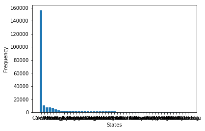

